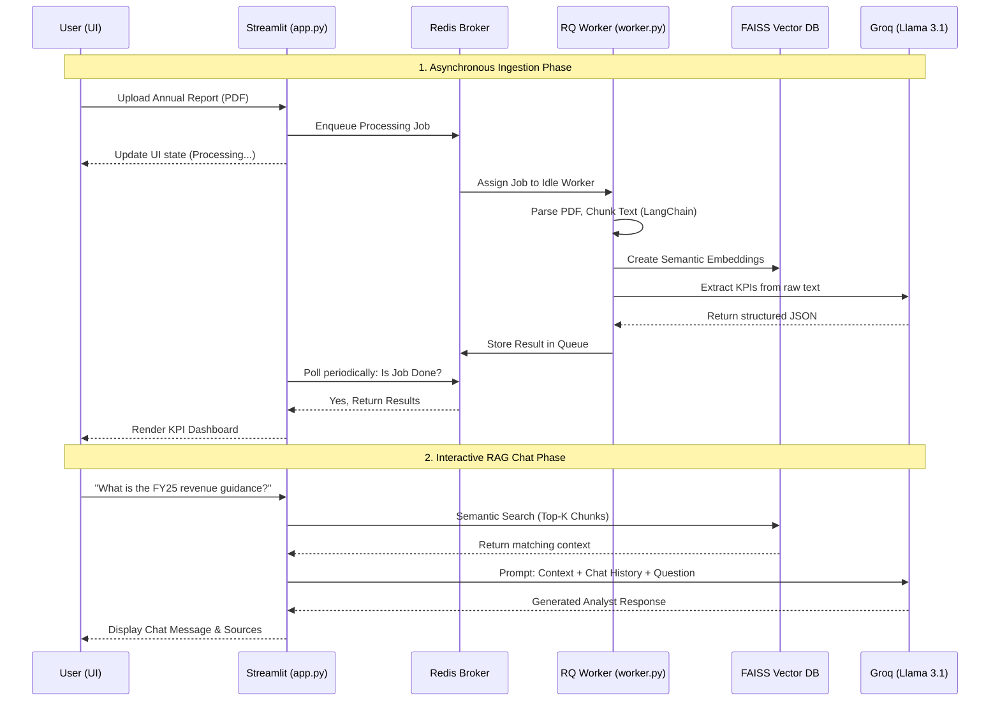

# 📈 ArthaMind - AI Financial Analyst 


**ArthaMind** is an enterprise-grade, asynchronous AI financial analysis platform. It ingests massive financial reports (PDFs), automatically extracts critical Key Performance Indicators (KPIs), and provides a fully conversational interface allowing users to interrogate complex financial data in real-time.

---

## 🏗️ System Architecture & Machine Learning Flow

ArthaMind implements a **Retrieval-Augmented Generation (RAG)** pipeline inside a highly decoupled, asynchronous architecture. 

Instead of freezing the UI while processing 500-page enterprise reports, the frontend delegates document ingestion to a background worker via a **Redis Message Broker**.

### 📊 System Diagram



---

## 🧠 The ML / RAG Engine Explained

ArthaMind doesn't depend on "memory" for its analysis; it uses **RAG (Retrieval-Augmented Generation)** to stay perfectly grounded in the provided document.

1. **Document Chunking (`ingest.py`)**: 
   The PDF is split into mathematically overlapping segments (chunks). This ensures that sentences spanning two pages or paragraphs aren't lost.
2. **Vector Embeddings (`chain.py`)**: 
   We pass the text chunks through `sentence-transformers` to convert words into high-dimensional vectors. Documents with similar semantic meanings are grouped closer together in the **FAISS** vector space.
3. **Semantic Hybrid Search**: 
   When a user asks: _"Why did net debt decrease?"_, the system converts the question to a vector, measures the mathematical distance to the document vectors, and pulls the top 5 most relevant chunks.
4. **LLM Synthesis (`prompts.py` + Groq)**: 
   The retrieved context, plus a strict "Senior Analyst Persona" prompt, is fed into **Llama 3.1 (via Groq API)**. The LLM reads only those 5 highly relevant chunks and formulates a precise, sourced answer in a fraction of a second.

---

## 📂 Codebase & File Roles

The system is decoupled to emulate a real-world microservices environment.

| File | Role / Responsibility |
|------|-----------------------|
| 🖥️ **`app.py`** | The main **Streamlit** frontend. Handles UI state, file uploading, queuing jobs into Redis, and the chat interface. It acts exclusively as the client. |
| ⚙️ **`worker.py`** | The **Background Worker process**. Contains a `SimpleWorker` that listens to Redis. It silently executes heavy computations (parsing, embedding, API calls) without blocking the UX. |
| 📚 **`ingest.py`** | The **Data pipeline**. Implements LangChain's PDF Loaders and RecursiveTextSplitters. Reads the raw documents and constructs the FAISS vector database. |
| 🔗 **`chain.py`** | The **AI Brain**. Initializes the Llama-3 model context, handles conversational memory mapping, and executes the vector search-to-generation chain. |
| 📋 **`prompts.py`** | The **Prompt Engineering layer**. Contains the master personas, including the strict JSON-output prompt used to accurately extract structured KPIs (Revenue, EPS, Debt, etc.) from raw text formats (Western and Indian number formats). |
| 🛠️ **`utils.py`** | The **Helper functions**. Contains logic for beautiful metric formatting and rendering Plotly gauge charts. |
| 🐳 **`docker-compose.yml`**| The **Infrastructure blueprint**. Provisions the Redis database and RedisInsight UI in isolated containers. |
| 📄 **`create_report.py`** | Utility script used to generate synthetic, highly realistic enterprise financial reports (PDFs) for testing the RAG pipeline. |

---

## 📦 Core Dependencies & Packages

### 🌐 The Web & UI Layer
* **`streamlit`** — Framework that turns Python scripts into interactive web apps instantly. Renders the UI, chat bar, and layout.
* **`plotly`** — Graphing library for interactive data visualizations used to build radial gauge charts on the dashboard.

### 🧠 The Core AI & Logic Layer
* **`langchain`** — Master framework that chains memory, prompt templates, logic, and models together.
* **`langchain-groq`** — Bridge implementation allowing LangChain to natively format requests for Groq's ultra-fast Llama 3.1 APIs.
* **`langchain-community`** — Ecosystem tools used here specifically to access `PyPDFLoader` to parse textual data out of PDF files.

### 📚 The Data & Text Processing Layer
* **`pypdf`** — Pure python library working behind the scenes to read, parse, and split PDF documents.
* **`sentence-transformers`** — Specialized ML models capable of turning words and sentences into vast arrays of mathematical vectors representing semantic definition.
* **`faiss-cpu`** — Facebook AI Similarity Search. An insanely fast local vector database that holds mathematical embeddings and performs nearest-neighbor vector searches in milliseconds.

### 🧰 Backend Utilities
* **`python-dotenv`** — Security standard practice that looks for the hidden `.env` file to load your API key into scripts without hardcoding it.
* **`pandas` & `numpy`** — Mathematical data wrangling used for managing matrices beneath Plotly charts and FAISS vectorization.
* **`pydantic`** — Data validation library enforcing strict rules ensuring the AI continuously outputs predictable, perfectly formatted JSON.

### 🚀 The Async Infrastructure Layer
* **`redis`** — The Python driver connecting your scripts to your Dockerized Redis message queue broker.
* **`rq`** (Redis Queue) — A lightweight job queueing system built on Redis. Powers the background `SimpleWorker` to quietly analyze massive PDFs without blocking the UI.
* **`fpdf`** — Allows programmatic generation of formatted PDF files (used to generate synthetic annual reports).

---

## 🚀 Quick Start Guide

### 1. Prerequisites
- **Python 3.9+**
- **Docker Desktop** (For Redis infrastructure)
- A **Groq API Key**

### 2. Infrastructure Setup (Redis)
Start the Redis backend and the RedisInsight GUI:
```bash
docker compose up -d
```
> _You can now view your live job queues and DB by visiting [http://localhost:8001](http://localhost:8001)_

### 3. Environment Setup
```bash
# Create and activate virtual environment
python3 -m venv .venv
source .venv/bin/activate  # macOS/Linux
# .\venv\Scripts\activate  # Windows

# Install dependencies
pip install -r requirements.txt

# Set your API Key
cp .env.example .env
# Edit .env and paste your Groq API link
```

### 4. Run the Engine
You need **two terminal tabs** running concurrently inside the virtual environment:

**Terminal 1 (The Worker):**
```bash
python worker.py
```

**Terminal 2 (The Frontend):**
```bash
streamlit run app.py
```

Visit **http://localhost:8501** in your browser, upload a financial report, and click **Analyze Async**!

---

## 🔒 Security & Performance
- **Local Vectors**: Sensitive financial embeddings are processed and kept entirely local via CPU-based FAISS.
- **Async Execution**: The UI polling architecture ensures the app never triggers server timeouts when handling 100+ page reports.
- **Cost Efficiency**: Operates entirely on open-source Llama 3 weights via Groq's high-throughput LPU arrays, keeping inference latency sub-500ms.
