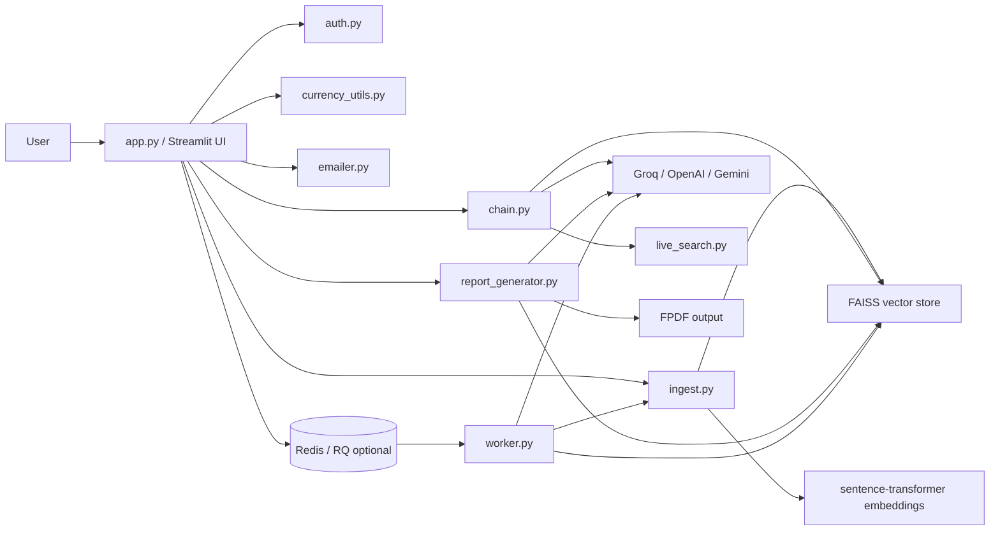

# ArthaMind - AI Financial Analyst

ArthaMind is a Streamlit-based financial analysis application that ingests PDF reports, extracts key metrics, builds a local vector index, and lets users analyze the report through chat, executive summaries, peer comparison, projection report generation, live web context, live FX conversion, and email delivery.

This README is written as an engineering guide to the repo. It explains:

- what the product does
- how the ML / RAG pipeline works
- how data moves through the app
- what every important file does
- which files are source code vs runtime artifacts

## What the app does

At a high level, ArthaMind supports these workflows:

- Upload one or more financial reports in PDF format.
- Extract KPI cards such as revenue, EBITDA, net income, debt, cash flow, and ROE.
- Ask questions against the uploaded report using a retrieval-augmented chat flow.
- Generate an executive summary for the active report.
- Upload competitor reports and run peer comparison.
- Generate a projection PDF for the next fiscal year using source-grounded report context.
- Convert displayed financial values into a selected display currency using live FX where available.
- Email the generated projection report as a PDF attachment.

## System architecture


```mermaid
flowchart LR
    U[User] --> A[app.py / Streamlit UI]
    A --> AUTH[auth.py]
    A --> ING[ingest.py]
    A --> CHAIN[chain.py]
    A --> FX[currency_utils.py]
    A --> REP[report_generator.py]
    A --> MAIL[emailer.py]

    ING --> VS[FAISS vector store]
    ING --> HF[sentence-transformer embeddings]

    CHAIN --> VS
    CHAIN --> LLM[Groq / OpenAI / Gemini]
    CHAIN --> WEB[live_search.py]

    REP --> VS
    REP --> PDF[FPDF output]
    REP --> LLM

    A --> REDIS[(Redis / RQ optional)]
    REDIS --> WORKER[worker.py]
    WORKER --> ING
    WORKER --> LLM
    WORKER --> VS
```

## End-to-end flow

### 1. Upload and ingest

When a user uploads a PDF:

1. `app.py` saves a persistent copy into `reports/`.
2. The upload is sent either:
   - to `worker.py` through Redis/RQ if async infrastructure is available, or
   - through the sync fallback path directly in the app.
3. `ingest.py` loads the PDF with `PyPDFLoader`.
4. Each page is tagged with `metadata["source_file"]`.
5. The text is chunked with `RecursiveCharacterTextSplitter`.
6. Embeddings are created using `sentence-transformers/all-MiniLM-L6-v2`.
7. Chunks are stored in a local FAISS index under `vector_store/financial_index/`.

Important behavior:

- The main upload path now replaces the primary `financial_index` for each new upload batch.
- That prevents old report chunks from leaking into summaries or chat answers for the newly uploaded report.
- Peer comparison uses separate in-memory vector stores and does not overwrite the primary index.

### 2. KPI extraction

After upload, the first pages of text are sent to the KPI extraction prompt:

- `chain.py` calls `extract_kpis_with_llm(...)`
- `prompts.py` provides a strict JSON schema prompt
- Groq is the primary KPI extraction engine

The extracted metrics are stored in session state and shown in the KPI dashboard.

### 3. Report chat

When a user asks a question:

1. `app.py` passes the question to `chain.py`.
2. `chain.py` builds a tool-calling agent or a direct-answer path depending on the selected provider.
3. `financial_document_search` retrieves chunks from FAISS, filtered to the active file when available.
4. Optional live web context is added through `live_search.py`.
5. The selected LLM synthesizes an answer using:
   - current question
   - recent chat history
   - retrieved report chunks
   - live web context when needed

### 4. Executive summary

`generate_summary(...)` in `chain.py`:

- retrieves broad context from the vector store
- filters retrieval to the active file
- formats a structured summary prompt from `prompts.py`
- generates the summary through the selected answer provider

### 5. Projection report generation

`report_generator.py` is a full subsystem of its own:

- reads the active uploaded PDF from `reports/`
- extracts grounded context from the report
- derives the next fiscal year
- interprets management instructions from the user
- builds a structured projection payload
- renders a board-style PDF with FPDF
- optionally lets the app send that PDF by email

The projection engine supports:

- source-grounded deterministic report generation
- live currency display conversion
- Unicode-safe PDF rendering
- assumption registers when the user asks for targets not fully supported by the source report

## ML / AI concepts used in the repo

This project is not “just an LLM wrapper.” It combines several ML and retrieval concepts:

### Retrieval-Augmented Generation (RAG)

The app does not expect the model to memorize the report. Instead:

- the report is chunked
- chunks are embedded into vectors
- relevant chunks are retrieved at question time
- only those chunks are provided to the LLM

This keeps answers grounded in the uploaded report rather than in model memory.

### Sentence embeddings

The embedding model converts text into dense vectors so semantically similar passages are close in vector space. That allows:

- “net debt reduced” to find text even if the exact phrasing differs
- retrieval of business risks, outlook, and guidance without exact keyword matches

### Vector search with FAISS

FAISS stores the embeddings locally and supports fast nearest-neighbor retrieval. In this repo it is the core retrieval layer for:

- report chat
- executive summaries
- grounded projection report context

### MMR retrieval

`chain.py` uses MMR-style retrieval for the document search tool. That helps avoid redundant chunks and improves diversity of retrieved context.

### Prompt-based information extraction

KPI extraction is implemented through a structured prompt rather than a classical supervised ML model. The prompt:

- tells the model what schema to output
- supports Indian and Western numbering formats
- forces JSON-only responses

### Tool-augmented reasoning

The analyst chat path can combine:

- report search
- live market data
- live web search

This turns the model from a pure text generator into a tool-using analyst assistant.

### Grounded financial projection generation

The projection engine blends:

- extracted KPI baseline
- report-derived sections such as risks, segments, and guidance
- user-stated targets
- optional LLM generation and repair passes

This is closer to a structured “AI report compiler” than a plain summarizer.

## File-by-file guide

### Core application files

| File | Role |
| --- | --- |
| `app.py` | Main Streamlit application. Owns UI, session state, file upload flow, KPI dashboard, chat, executive summary, peer compare, currency selector, live FX refresh, projection generation, and email sending. |
| `auth.py` | Authentication layer. Handles local email/password auth, Google OAuth, SQLite user storage, persistent session tokens, and login UI helpers. |
| `chain.py` | Main AI orchestration layer. Contains provider selection, Groq/OpenAI/Gemini text generation helpers, KPI extraction, document search tools, live-price helpers, agent construction, direct-answer flow, peer comparison, and executive summary generation. |
| `ingest.py` | PDF ingestion and vector-store layer. Loads PDFs, adds `source_file` metadata, chunks text, builds or replaces FAISS indexes, and loads saved indexes from disk. |
| `worker.py` | Optional background ingestion worker for Redis/RQ mode. Processes uploaded PDFs asynchronously, extracts KPIs, and rebuilds the main vector store without blocking the UI. |
| `prompts.py` | Prompt library. Stores the financial-system prompt, KPI extraction prompt, summary prompt, comparison prompt, and the agent system prompt. |
| `live_search.py` | Live web search provider wrapper. Supports OpenAI Web Search, Gemini Google Search, and formatted output with citations and error handling. |
| `currency_utils.py` | Currency parsing and conversion subsystem. Detects currencies from raw KPI strings, converts amounts between currencies, uses live Frankfurter FX data with cache/fallback behavior, and formats values for KPI cards and reports. |
| `report_generator.py` | Projection-report engine. Builds structured grounded projection payloads, parses report sections, normalizes currencies, and renders final PDFs. |
| `emailer.py` | SMTP email sender for generated projection PDFs. Supports multiple recipients and HTML email bodies. |
| `utils.py` | Shared helpers used by the app and chain. Includes KPI formatting wrappers, retry logic, chart helpers, answer-highlighting helpers, and UI sample questions. |

### Configuration and infrastructure files

| File | Role |
| --- | --- |
| `requirements.txt` | Python dependency list for the app. |
| `docker-compose.yml` | Optional local Redis infrastructure for async upload processing. |
| `runtime.txt` | Runtime hint used by some deployment platforms. |
| `.env.example` | Example local environment variables for API keys and providers. |
| `.streamlit/config.toml` | Streamlit runtime config. In this repo it disables file watching for some folders to keep local development stable. |
| `.streamlit/secrets.toml.example` | Example secrets file for Streamlit Cloud deployment. |
| `.python-version` | Python version hint for local toolchains like pyenv. |
| `.gitignore` | Git ignore rules. |
| `README.md` | This documentation file. |

### Runtime, generated, and state files

| Path | Role |
| --- | --- |
| `reports/` | Persistent copies of uploaded source PDFs. `report_generator.py` also reads from here to ground projection reports. |
| `vector_store/financial_index/` | Saved FAISS index for the current primary upload batch. Contains `index.faiss` and `index.pkl`. |
| `users.db` | SQLite database used by `auth.py` to store users. |
| `.arthamind_sessions.json` | Persistent login session tokens. |
| `.arthamind_last_token` | Stores the last active auth token locally. |
| `__pycache__/` | Python bytecode cache. Generated automatically. |
| `.venv/` | Local virtual environment. Not application logic. |

## Important implementation concepts by file

### `app.py`

`app.py` is the orchestration shell around everything else. Its responsibilities are broader than just rendering UI:

- initializes app-wide session state
- chooses answer engine and search provider
- manages async vs sync ingestion paths
- persists uploaded files into `reports/`
- chooses the active report file
- keeps the chat agent synchronized with the selected model and active document
- invalidates stale generated PDFs when the report pipeline version or display currency changes

If you want to understand product behavior first, start here.

### `chain.py`

This file is the AI backbone of the repository.

Key concepts implemented here:

- provider normalization
- model fallback rules
- direct-answer generation for non-Groq providers
- Groq tool-calling agent for report chat
- active-file-aware document retrieval
- live web search integration
- executive summary generation
- peer comparison generation

If `app.py` is the shell, `chain.py` is the reasoning engine.

### `ingest.py`

This file controls how raw PDFs become searchable knowledge:

- PDF bytes -> LangChain documents
- documents -> overlapping chunks
- chunks -> embeddings
- embeddings -> FAISS persistence

It also determines where vector stores live:

- locally in `./vector_store`
- or in `/tmp/arthamind_store` on cloud-like environments

### `worker.py`

`worker.py` exists so large uploads can be handled outside the request/response cycle.

Responsibilities:

- receives queued upload jobs
- loads PDFs
- extracts KPIs per file
- aggregates chunks across the upload batch
- rebuilds the main `financial_index`

Redis is optional. The app has a sync fallback path if Redis or Docker is unavailable.

### `report_generator.py`

This file is effectively a sub-application. It contains:

- source report loading
- section parsing
- business-line extraction
- risk/scenario extraction
- unit detection and conversion
- grounded target-case projection logic
- LLM fallback/repair logic
- final FPDF rendering

If you want to work on the “Generate Projection Report” feature, spend most of your time here.

### `currency_utils.py`

This file owns all financial-display currency behavior:

- parse strings like `$5,840 Mn`, `Rs. 15,000 Crore`, `€492 million`
- detect source currency
- convert to selected display currency
- fetch live FX with cache
- fall back gracefully if live FX is unavailable

This separation is important because both the KPI dashboard and the PDF report generator depend on the same conversion logic.

## Runtime behavior worth knowing

### Main upload behavior

- A new primary upload batch replaces the old primary FAISS index.
- This prevents stale context from earlier uploads leaking into current answers.
- The active report is tracked by `source_file` metadata plus `st.session_state.active_file`.

### Multi-document behavior

- Primary uploads can include multiple documents in one batch.
- Peer comparison documents are handled separately from the primary batch.
- Summary and chat should use the active file rather than whichever file happened to be uploaded first.

### Redis behavior

Redis is optional.

- If Redis and RQ are installed and reachable, the app can process uploads asynchronously.
- If Redis is unavailable, the app falls back to synchronous processing.
- Docker is only needed if you want local Redis-based async processing.

### Live FX behavior

- Live FX is fetched from Frankfurter.
- Rates are cached in memory.
- If the live request fails, the app falls back to stored assumptions and surfaces that state in the UI.

## Environment variables

### Core LLM and web search

| Variable | Purpose |
| --- | --- |
| `GROQ_API_KEY` | Required for KPI extraction and Groq answer/report paths. |
| `OPENAI_API_KEY` | Optional. Enables OpenAI answer engine and OpenAI live web search. |
| `GEMINI_API_KEY` | Optional. Enables Gemini answer engine. |
| `GEMINI_WEB_API_KEY` | Optional second Gemini key used only for live web search. |
| `ANSWER_PROVIDER` | Default answer provider: `groq`, `openai`, or `gemini`. |
| `LIVE_SEARCH_PROVIDER` | Default live web provider: `openai`, `gemini`, or `duckduckgo`. |
| `OPENAI_WEB_SEARCH_MODEL` | Override OpenAI web-search model. |
| `GEMINI_WEB_SEARCH_MODEL` | Override Gemini web-search model. |

### Email delivery

| Variable | Purpose |
| --- | --- |
| `EMAIL_SENDER` | Gmail address used to send generated reports. |
| `EMAIL_APP_PASSWORD` | Gmail app password for SMTP. |

### Google OAuth

| Variable | Purpose |
| --- | --- |
| `GOOGLE_CLIENT_ID` | Google OAuth client ID. |
| `GOOGLE_CLIENT_SECRET` | Google OAuth client secret. |
| `GOOGLE_REDIRECT_URI` | Redirect URI for Google OAuth. Defaults to `http://localhost:8501/`. |

### Optional Redis / cloud

| Variable | Purpose |
| --- | --- |
| `REDIS_HOST` | Redis host. |
| `REDIS_PORT` | Redis port. |
| `REDIS_PASSWORD` | Redis password if needed. |

## Dependencies and why they exist

| Package | Why it is used |
| --- | --- |
| `streamlit` | Main UI framework. |
| `langchain`, `langchain-community`, `langchain-groq` | Orchestration, document loading, retrieval, and Groq integration. |
| `sentence-transformers` | Embedding model for semantic search. |
| `faiss-cpu` | Local vector index. |
| `pypdf` | PDF parsing and text extraction. |
| `plotly`, `pandas`, `numpy` | Dashboard visual and data helpers. |
| `redis`, `rq` | Optional async upload processing. |
| `duckduckgo-search`, `yfinance` | Live context and market-data helpers. |
| `bcrypt`, `requests-oauthlib` | Authentication and OAuth. |
| `python-dotenv` | Local environment variable loading. |
| `fpdf` | Projection PDF rendering. |

## Local development

### 1. Create the environment

```bash
python3 -m venv .venv
source .venv/bin/activate
pip install -r requirements.txt
cp .env.example .env
```

### 2. Start the app

Simplest mode, no Redis required:

```bash
streamlit run app.py
```

### 3. Optional async mode with Redis

Start Redis:

```bash
docker compose up -d
```

Start the worker:

```bash
python worker.py
```

Then run the Streamlit app in another terminal:

```bash
streamlit run app.py
```

## Suggested reading order for new developers

If someone is onboarding into this repo, this order works well:

1. `README.md`
2. `app.py`
3. `chain.py`
4. `ingest.py`
5. `report_generator.py`
6. `currency_utils.py`
7. `prompts.py`
8. `worker.py`
9. `auth.py`
10. `live_search.py`, `emailer.py`, `utils.py`

## Mental model of the repo

The cleanest way to think about ArthaMind is:

- `app.py` = product shell and UI state
- `ingest.py` + `worker.py` = document indexing pipeline
- `chain.py` + `prompts.py` + `live_search.py` = reasoning layer
- `report_generator.py` = projection-report subsystem
- `currency_utils.py` = financial-display normalization layer
- `auth.py` + `users.db` = access control
- `reports/` + `vector_store/` = runtime knowledge base

That model maps very closely to how the code is actually structured today.
